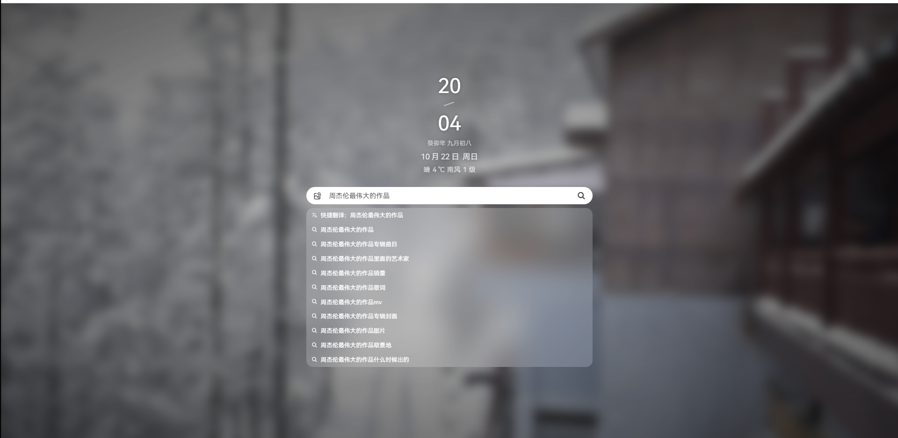

# 图片搜索引擎
> 前端参考自 [Snavigation](https://github.com/imsyy/Snavigation)
> 后端参考自 [bytedance-youthcamp-search-engine](https://github.com/optimjie/bytedance-youthcamp-search-engine)
## 效果图

1. 输入搜索内容



2. 搜索内容展示


## 部署流程

### 后端部署

> 账户：root 
>
> 密码：123456

1. 创建数据库

```mysql
create database search_engine;
```

2. 建立`data`表

```mysql
create table data
(
    id      int auto_increment
        primary key,
    url     text         null,
    caption varchar(255) null
)
    charset = utf8;
```

3. 建立`segment`表

```mysql
create table segment
(
    id   int auto_increment
        primary key,
    word varchar(50) null
)
    charset = utf8;
```

4. 用爬虫获取数据写入`data`表

> 注意work函数第一行注释

```python
from typing import *
import requests
import urllib
import pymysql


def crawler(keyword: str) -> List[Tuple]:
    # 将关键词转为 url 编码
    keyword = urllib.parse.quote(keyword)
    # 生成关键词对应的 url
    url = 'http://image.baidu.com/search/acjson?tn=resultjson_com&ipn=rj&ct=201326592&is=&fp=result&queryWord={}\
            &cl=2&lm=-1&ie=utf-8&oe=utf-8&adpicid=&st=-1&z=&ic=&hd=1&latest=0&copyright=0&word={}\
            &s=&se=&tab=&width=&height=&face=0&istype=2&qc=&nc=1&fr=&expermode=&force=&cg=star&pn=30\
            &rn=30&gsm=78&1557125391211='.format(keyword, keyword)
    data = requests.get(url, headers={
        'User-Agent': 'Mozilla/5.0 (Windows NT 10.0; WOW64) AppleWebKit/537.36(KHTML, like Gecko)' 'Chrome/69.0.3497.81 ' 'Safari/537.36'
    }).json().get('data')
    return list(set((json.get('thumbURL'), json.get('fromPageTitle') \
                     .replace('<strong>', '').replace('</strong>', '')) \
                    for json in data if json and json.get('thumbURL')))


def solve():
    f = open('idf_dict.txt', 'r', encoding='utf-8')	  # 替换成你的关键词文件  一行一个
    images = []
    # 55040
    for _ in range(3000):
        s = f.readline().split()[0]
        try:
            images += crawler(s)
        except:
            continue
    connect = pymysql.connect(
        host='localhost',
        user='root',
        password='123456',
        database='search_engine',
        charset='utf8'
    )
    cursor = connect.cursor()
    for url, title in images:
        try:
            cursor.execute('INSERT INTO data VALUES (null, %s, %s)', (url, title))
        except:
            continue
    connect.commit()
    connect.close()


if __name__ == '__main__':
    solve()
```

5. 生成`segment`表内容以及倒排索引表

依次运行`src/test/java/com/search/DatabaseInitializer.java`下的

`public void InitSegmentTable()`

`public void initDataSegRelationTable()`

### 前端部署

需要`node.js`

```bash
# 安装 pnpm
npm install -g pnpm

# 安装依赖
pnpm install
```

